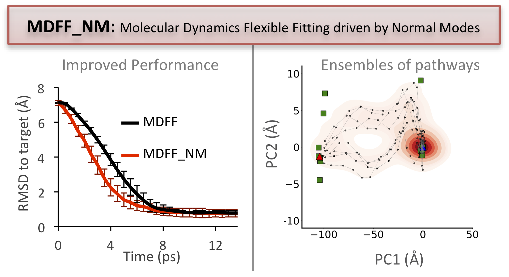

# MDFF_NM
Run Molecular Dynamics Flexible Fitting guided by Normal Modes

This repository provides the required files to carry out [MDFF_NM](https://pubs.acs.org/doi/10.1021/acs.jcim.3c02007?goto=supporting-info) simulations, an extension of the original Molecular Dynamics Flexible Fitting method [(MDFF)](https://www.sciencedirect.com/science/article/pii/S0969212608001330) implemented in the VMD/NAMD ecosystem. 

The [MDFF_NM tutorial](MDFF_NM_tutorial_2024.html) allows the basic usage of the method and the reproduction of some results found in the original publication

<p align="center">

</p>

<br> <br>
Molecular Dynamics Flexible Fitting (MDFF) is a widely used tool to refine high-resolution structures into cryo-EM density maps. Despite many successful applications, MDFF is still limited by its high computational cost, overfitting, accuracy, and performance issues due to entrapment within wrong local minima. Modern ensemble-based MDFF tools have generated promising results in the past decade. In line with these studies, we present MDFF_NM, a stochastic hybrid flexible fitting algorithm combining Normal Mode Analysis (NMA) and simulation-based
flexible fitting. Initial tests reveal that, besides accelerating the fitting process, MDFF_NM increases the diversity of fitting routes
leading to the target, uncovering ensembles of conformations in closer agreement with experimental data.
<br> <br>

All input/output manipulations, normal modes and linear algebra calculations are carried out with R using its internal functions and the routines included in the [Bio3D package](http://thegrantlab.org/bio3d/)


### **Requirements**

#### **install R** 
R can be easily installed through the package manager. Alternatively, it may also be downloaded from the [R-project web site](https://www.r-project.org/).

```{r, eval = FALSE}
apt-get install r-base-core 
```

#### **install the Bio3D package** 
To obtain the Bio3D package, start R and then type the following line:

```{r, eval = FALSE}
install.packages("bio3d")
```

Additional instructions for obtaining and installing the Bio3D package can be found in the [Installing Bio3D Vignette](http://thegrantlab.org/bio3d/tutorials).  

#### **install VMD 1.9.4** 
[Installation instructions](https://www.ks.uiuc.edu/Research/vmd/)

#### **install NAMD** 
Download the [NAMD executable](http://www.ks.uiuc.edu/Development/Download/download.cgi?PackageName=NAMD). 

To invoke NAMD from R, we advise users to edit the bash_profile file entering the place where the namd2 executable is found:
```{r, eval = FALSE}
export PATH="/path-to-namd-executable/:$PATH" 
```

#### **Download CatDCD** 
We also strongly encourage users to download the [catdcd](https://www.ks.uiuc.edu/Development/MDTools/catdcd/) executable for analysis of trajectories nd make it accesible from everywhere. Again users should edit the bashrc file and enter the line below. 

```{r, eval = FALSE}
export PATH="/path-to-catdcd-executable/:$PATH" 
```
### **Before starting** 

In this tutorial we selected the adenylate kinase protein (ADK) as test system as described in the original [MDFF tutorial](https://www.ks.uiuc.edu/Training/Tutorials/science/mdff/tutorial_mdff-html/). We strongly encourage users to follow the tutorial (at least going through the item 2 ["A simple MDFF Example"](https://www.ks.uiuc.edu/Training/Tutorials/science/mdff/tutorial_mdff-html/node4.html)) before testing MDFF_NM. 

Both MDFF and MDFF_NM are usually applied to fit an atomic structure into a low-resolution density map of the same macromolecule imaged in a different conformation. Here, the closed ADK state was taken as initial coordinates, but instead of using an actual EM target map, a synthetic (theoretical) map will be generated from the ADK coordinates in the open state. 

All routines related to generation and manipulation of EM maps are executed following the original MDFF tutorial. We provide in the [mdff_nm_example_files.zip file](mdff_nm_example_files.zip) all scripts required to execute these steps. 


